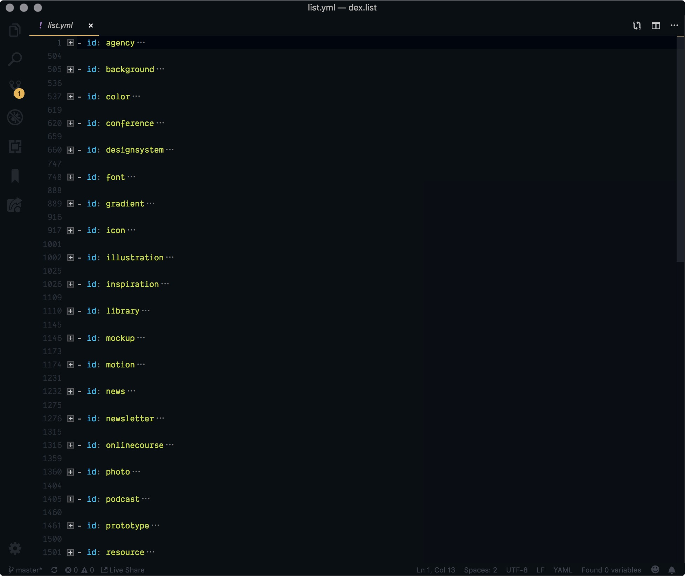

<h2>DEX List <a href='https://app.netlify.com/sites/functions/deploys'></a>
</h2>


1.  **Clone this project**

    ```
    git clone https://github.com/dingyi/DEX-List-data
    ```

2.  **Navigate to directory**

    ```
    cd DEX-List-data
    ```

### Logo

- 尺寸：64px x 64px
- 格式：PNG

### YML data



```
- name: '3drops'
  logo: './images/agency/3drops.png'
  location: '🇸🇪'
  slogan: 'Digital Product Studio'
  link: 'https://3dro.ps/'
```

### 说明：

- name, logo, slogan, link 为必要字段。
- location 只在 agency 分类存在，price 在其他分类，这两个字段可为空。
- 图片可以用 ImageOptim 等工具处理后再更新


Thanks:)


